<!-- _class: title -->
# GitHub CodeSpacesハンズオン

---
<!--
header: ""
_class: slides
-->
## 対象者
- 開発者

---
<!--
header: ""
_class: slides
-->
## 本日のテーマ
- GitHub CodeSpacesを用いての体験

## スコープ外
- GitHub CodeSpacesの詳細な構造説明
- サンプルソースの構造

---
<!-- _class: slides -->
# 今日のSTEP
- GitHubリポジトリにアクセス
- 開発環境構築
- 実行

---
<!-- _class: slides -->
# GitHubリポジトリにアクセス

- [https://github.com/asahi13/todomvc.git](https://github.com/asahi13/todomvc.git)

---
<!-- _class: slides -->
# 開発環境構築
<div class="canvas">

<div style="float:left;width:50%;font-size:30px;">

1. code->Codespace tab->Create codespace on main
- 4cpu 
- RAM 8GB
- 32GB

2. terminalでバージョンの確認
```bash
java -version
node -v
```
</div>

<div style="float:left;width:50%;">
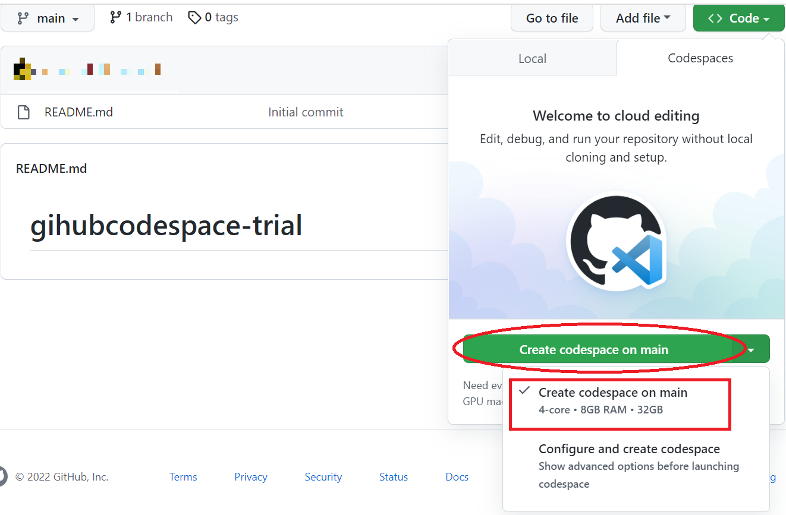

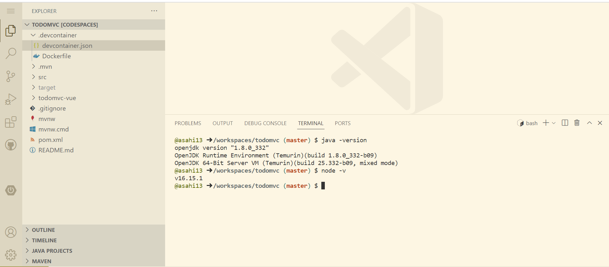
</div>
</div>

---
<!-- _class: slides -->
# 実行
<div class="canvas">

<div style="float:left;width:50%;font-size:30px;">

1. terminalから実行
```bash
./mvnw spring-boot:run
```
2. `Open in Browser`をクリックすると画面が開きます。
`user:user`でログインしてください。  
  ※アプリの停止はterminalで`Ctrl+C`

</div>

<div style="float:left;width:50%;">
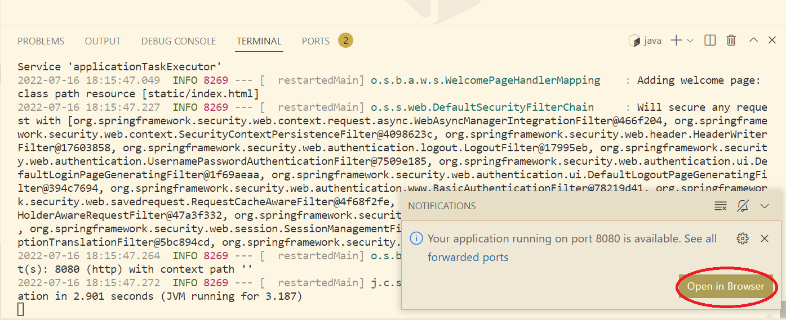
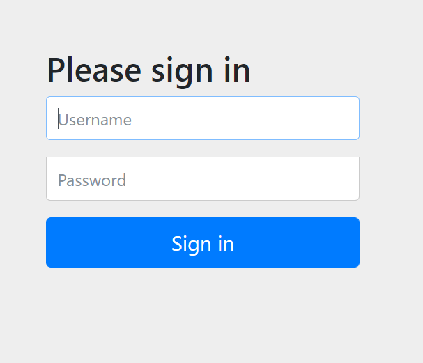

</div>
</div>


---
<!-- _class: slides -->
# ブランチを作成してソース修正
<div class="canvas">
<div style="float:left;width:50%;font-size:30px;">

1. ブランチを作成
ブランチを作成して、更新してみましょう。  
`Home.vue`あたりが修正しやすいです。

</div>

<div style="float:left;width:50%;">


</div>
</div>

---

<!-- _class: slides -->
# 構造説明
<div class="canvas">

<div style="float:left;width:65%;">
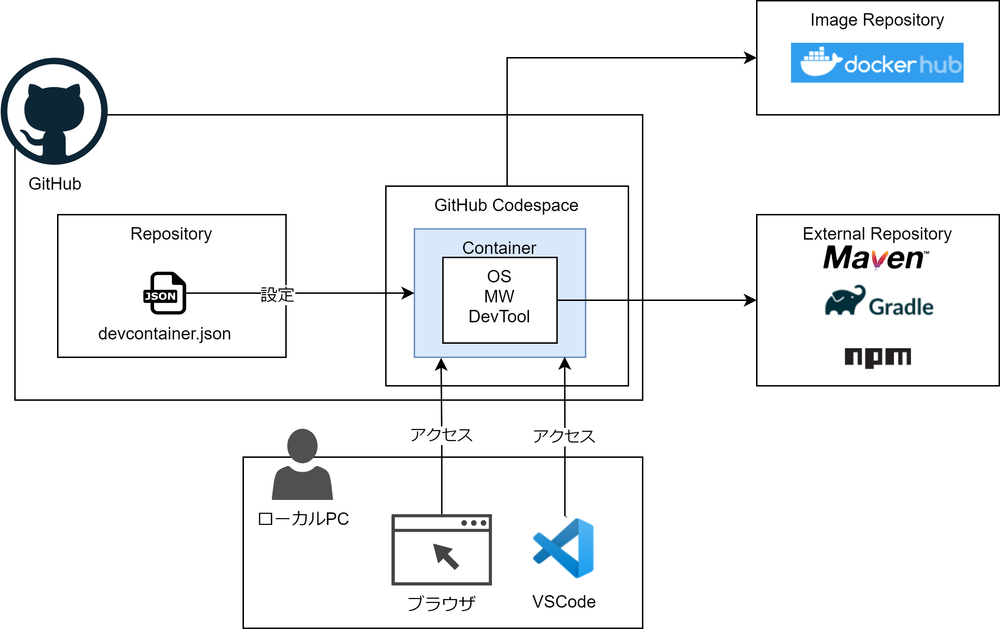

</div>
<div style="float:left;width:35%;font-size:30px;">

- GitHubCodespace上に`Container`が起動
- ローカルPCはアクセスのみ
- ライブラリリポジトリのとの通信は`Container`から

</div>

</div>

---

<!-- _class: slides -->
# メリット

- 環境構築の手順に前提知識が不要
- ローカルPCに依存せずにリポジトリ毎に環境を用意できる
- ローカルPCが端末が熱くならない
- 複数の開発者がOSレベルで同じ環境になる

---

<!-- _class: slides -->
# デメリット

- グループ開発は[有料](https://docs.github.com/en/billing/managing-billing-for-github-codespaces/about-billing-for-github-codespaces#github-codespaces-pricing) 
- ベースとなる`DockerImage`の用意が必要  
  ※Microsoft等、一般的なimageは多数公開されている
- 30分アクセスしていないと、docekrが停止する

---

<!-- _class: slides -->
# 最後に

このテクノロジーは知識が浅くても開発環境の構築、破棄が可能です。  
失敗を恐れず、むしろ失敗を前提として、様々なテクノロジーに触れましょう。

このハンズオンが皆さんの学びの促進になれば幸いです。

---
<!-- _class: title -->
# *Happy Developers Life!*


---
<!-- _class: title -->
# APPENDIX

---
<!-- _class: slides -->
# ローカルVSCodeからの接続 1
<div class="canvas">
<div style="float:left;width:50%;font-size:30px;">

1. VSCode拡張機能をインストール  
<br/>
<br/>
<br/>
<br/>
2. VSCode左下のアイコンから`Codespace`を選択
</div>

<div style="float:left;width:50%;">
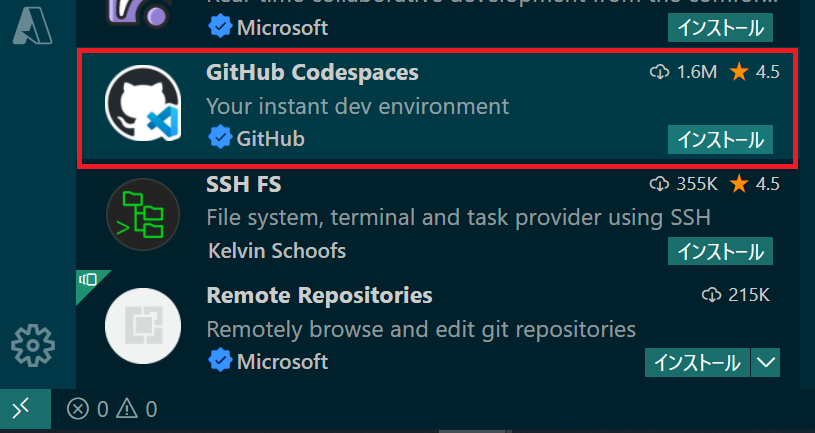

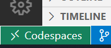

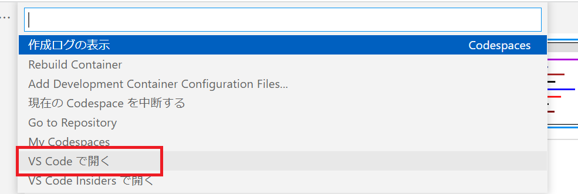

</div>
</div>

---
<!-- _class: slides -->
# ローカルVSCodeからの接続 2
<div class="canvas">
<div style="float:left;width:50%;font-size:30px;">

1. アラートを全て許可して、GitHubへの`Sign In`  
<br/>

2. GitHub側でアクセス許可`Authorize Visual-Studio-Code`をクリック
</div>

<div style="float:left;width:50%;">
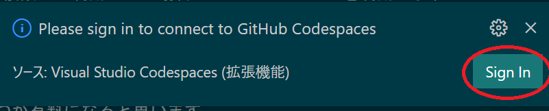

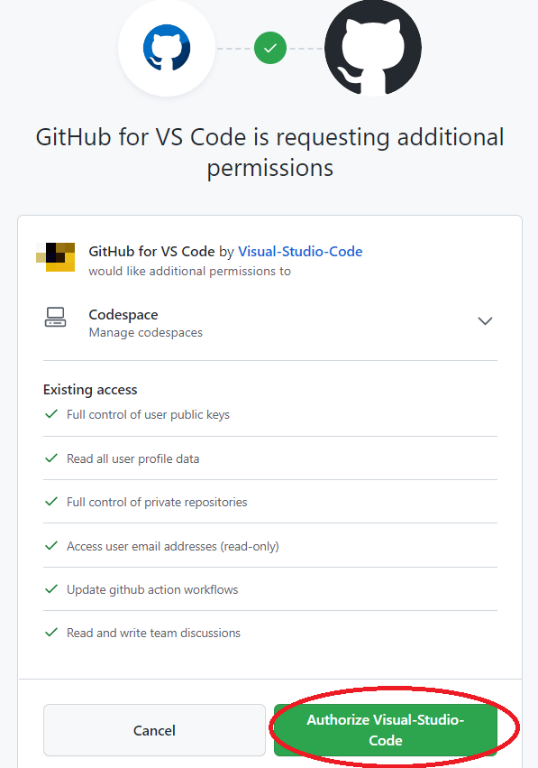


</div>
</div>

---
<!-- _class: slides -->
# ローカルVSCodeからの接続 3
<div class="canvas">
<div style="float:left;width:50%;font-size:30px;">

1. アラートを全て許可して、接続完了  
:heart::heart:

</div>

<div style="float:left;width:50%;">
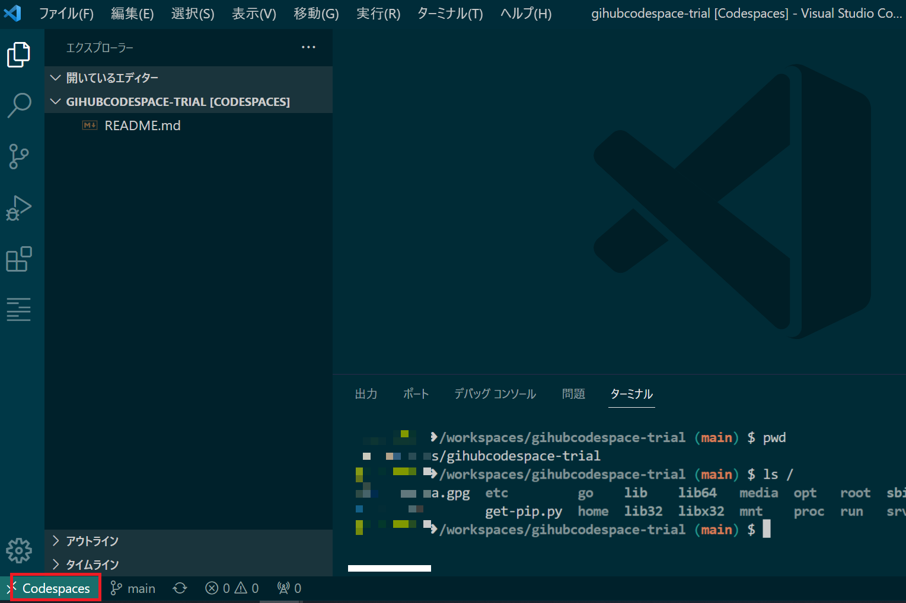

</div>
</div>

---
<!-- _class: title -->
# END


